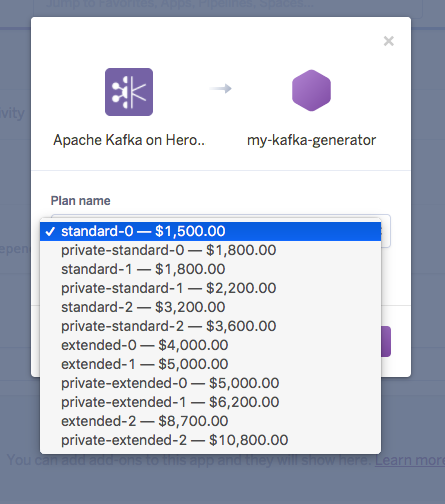
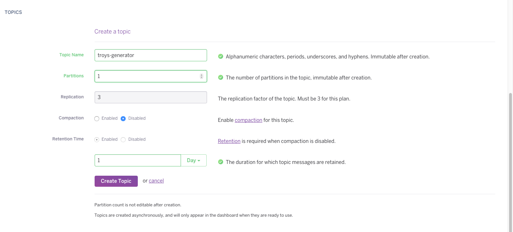

### Heroku 301 - Generator

# Heroku 301

In this exercise we are going to look at Kafka Producer and Consumer application as well as a web/worker pattern as a means for distributing load in Heroku via a traditional queue as well.

## Prerequisites 
You should definitely have a look at the Heroku-101 prerequisites, as we use the same tools there again. 
We also need to install our first plugin to the Heroku CLI (that's right, it's extensible!) 

See [Preparing Your Environment](https://devcenter.heroku.com/articles/kafka-on-heroku#preparing-your-development-environment) for details on how to ensure the Kafka CLI commands are installed. 

## Kafka
The introduction section on the Kafka home does an excellent job of explaining what Kafka is, so I encourage you to head over and have a look. Also, have a look at the Heroku docs that talk about our service as well. 

For the purpose of this exercise today we will use the multi-tennant kafka service. 

## Create a Kafka Producer

This time we are going to run this a little differently, as we have already built our app from scratch. This time, let us clone the codebase we need and start from there.

```
> git clone https://github.com/ibigfoot/heroku-301-generator
> cd heroku-301-generator
```

This will give us a copy of code locally we can work with and explore. 
Now, let's get this ready for eclipse and explore the code

```
> mvn eclipse:eclipse
```


Then we can build the codebase to ensure we are good to go.
```
> mvn clean package
``` 

### Deploy 

So now we want to connect to some Kafka! But first we will need to create an app and probably a Topic on our Kafka service. 
Firstly, creating an app and push your code to it.

```
> heroku create my-kafka-generator
> git push heroku master
```

From the build log, you should see that this is another java application. 
Open up Eclipse (or your tool of choice) and look at the Procfile, it should have a single line in it. 

```
worker: java -jar target/kafka-gen-jar-with-dependencies.jar
```

Now, open your Heroku dashboard and find your application. 


This application now has a single worker dyno, but no web dynos and can be considered to be effectively headless. It is fairly simple in that it is going to run and send random information to a Kafka Topic, but first we are going to need some Kafka!

Go to the resources tab and search for the Kafka Add On



You will see that the Kafka service starts at $1500 per month, not bad for a fully managed deployment of Kafka. However, seeing as this is just a training day it might be best to use one that I have already created. Thankfully, we can do this using the commandline quite easily.

```
> heroku addons:attach <<heroku addon name>>
```

In your data dashboard you can find the instance of Kafka we are all using and go ahead and create your own topic.



Now you can see that there has been a few extra configuration variables added to your application, have a look.

```
> heroku config
```

The application source code will look for the following that have been created as part of attaching the Heroku Kafka addon
- KAFKA_CLIENT_CERT
- KAFKA_CLIENT_CERT_KEY
- KAFKA_TRUSTED_CERT
- KAFKA_URL

But we will also need two more
- KAFKA_TOPC
- INTERVAL

go ahead and add them now

```
> heroku config:set KAFKA_TOPIC=<<your topic name>>
> heroku config:set INTERVAL=500
```

You should now be ready to start you application and have it sending messages to your kafka topic.

```
> heroku ps:scale worker=1:Standard-1x
```


Once it has started up, tail the logs

```
> heroku logs --tail
```

Or, have a look at what is being published on the topic. 

```
> heroku kafka:topics:tail <<your topic name
```
